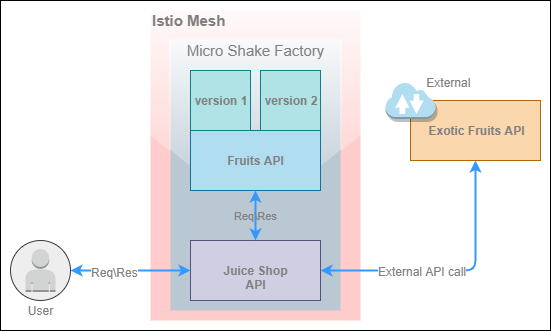

# Micro Shake Factory

> Companion repo for the title [**Istio Succinctly**](https://www.syncfusion.com/ebooks/istio-succinctly) by Syncfusion.

[](https://www.syncfusion.com/ebooks/istio-succinctly)

This is a monorepo that contains the code of two REST microservices viz. **fruits-api** and **juice-shop-api**. Collectively these microservices form the _Micro Shake Factory_ application.

> The objective of the book is to help you learn Istio. Therefore, you are only required to know the API endpoints of the services and some of their features. You are not required to modify the services or publish the container images of the services to a container registry. We have published the images of the services to a Docker Hub [public repository](https://hub.docker.com/u/istiosuccinctly) that you can consume.

## Istio Succinctly

Download Istio Succinctly for free from Syncfusion.

> Placeholder for image

## Getting started

Micro shake factory is a simple application that simulates a fruit juice shop. The following is the high-level design diagram of the application.



The capabilities of Istio can be adequately demonstrated with a set of services that can communicate with each other. The micro shake factory application consists of two REST based microservices with the following capabilities.

- **Fruits API**: This API manages the inventory of fruits and their prices by country. This API has the following endpoints.

| API Endpoint                          | Function                                                                                                                                                                   |
| ------------------------------------- | -------------------------------------------------------------------------------------------------------------------------------------------------------------------------- |
| GET: /api/fruits/:country             | Returns a list of fruits and based on the country code provided. The valid country codes are usa, au, and ind.                                                             |
| GET: /api/fruits/special              | Returns a specialty fruit that is specific to the version of the API that handles the request. Version 1 of the API returns Mango and version 2 of the API returns Orange. |
| GET: /api/fruits/:country/:name/price | Returns the price of a fruit (specified in the parameter name) in a country (specified in the parameter country).                                                          |

- **Juice Shop API**: This API primarily communicates with the Fruits API and to fetch fruit prices and determines the price of the juice ordered by the customer. Additionally, this API communicates with an external API to present certain fruits that are not available with the Fruits API. This API has the following endpoints.

| API Endpoint                      | Function                                                                                                                                                                                                                        |
| --------------------------------- | ------------------------------------------------------------------------------------------------------------------------------------------------------------------------------------------------------------------------------- |
| POST: /api/juice-shop/blender     | Takes the names of two fruits as input and communicates with the Fruits API over HTTP to retrieve the prices of the fruits. This endpoint returns the name and price of the juice prepared from the fruits sent in the request. |
| GET: /api/juice-shop/exoticFruits | Fetches a list of fruits from an external API. Currently, this API is modeled as a static document available [here](https://raw.githubusercontent.com/Istio-Succinctly/ExoticFruits/master/fruits.json).                        |
| GET: /api/juice-shop/hello        | Returns a greeting message.                                                                                                                                                                                                     |
| GET: /api/juice-shop/testMyLuck   | Returns HTTP error status code 500 for around 80% requests and a success response for the remainder requests.                                                                                                                   |

The Docker container images of the microservices are present at the following locations:

1. **Fruits API**: [Link](https://hub.docker.com/r/istiosuccinctly/fruits-api)
2. **Juice Shop API**: [Link](https://hub.docker.com/r/istiosuccinctly/juice-shop-api)

## Building the application

The following information will help you set up the application on your system for local development and debugging.

### Built with

The following tools, frameworks, and packages have been used to build this application:

1. Node.js (v 12.8.0)
2. Restify
3. Typescript
4. Yarn (v 1.17.3)
5. Tests: Mocha, Chai, Sinon, Supertest
6. Docker Desktop

### Prerequisites

Download and install Nodejs, Yarn, and Docker Desktop from their respective websites.

### Setting up the Dev environment

Execute the following command sequence to launch the _fruits-api_ service at [http://localhost:3000](http://localhost:3000).

```shell
git clone https://github.com/Istio-Succinctly/MicroShakeFactory.git
cd fruits-api/
yarn install
yarn start
```

You can execute the following commands from the same location to execute the tests.

1. `yarn test`: This command will execute all the tests present in the _test_ folder.
2. `yarn test:coverage`: This command will generate a code coverage report.

Execute the commands `yarn install` and `yarn start` again after changing to the _juice-shop-api_ folder to launch the _juice-shop-api_ service at [http://localhost:3001](http://localhost:3001) and [https://localhost:4000](https://localhost:4000). Executing the commands `yarn test` and `yarn test:coverage` at this location will execute tests for the juice-shop-api project.

### Creating Docker image

The Windows command file _push-images.cmd_ at the root folder contains Docker commands to create Docker images and push the generated images to Docker Hub for both the microservices. You won't be able to push the images to the upstream registry, but by executing the command, you will get the images in your local registry. If you are using another operating system, use the commands present inside the file to do the same.

## Versioning

We have used [SemVer](http://semver.org/) for versioning the microservices. The _fruits-api_ service has two versions 1.0.0 and 2.0.0, which differ in the response they produce for a request to the _/api/fruits/special_ endpoint. The _juice-shop-api_ service has a single version- 1.0.0.

## Tests

Executing the following commands from terminal changed to either the _juice-shop-api_ or _fruits-api_ directory will execute the tests.

1. `yarn test`: This command will execute all the tests present in the _test_ folder.
2. `yarn test:coverage`: This command will generate a code coverage report.
